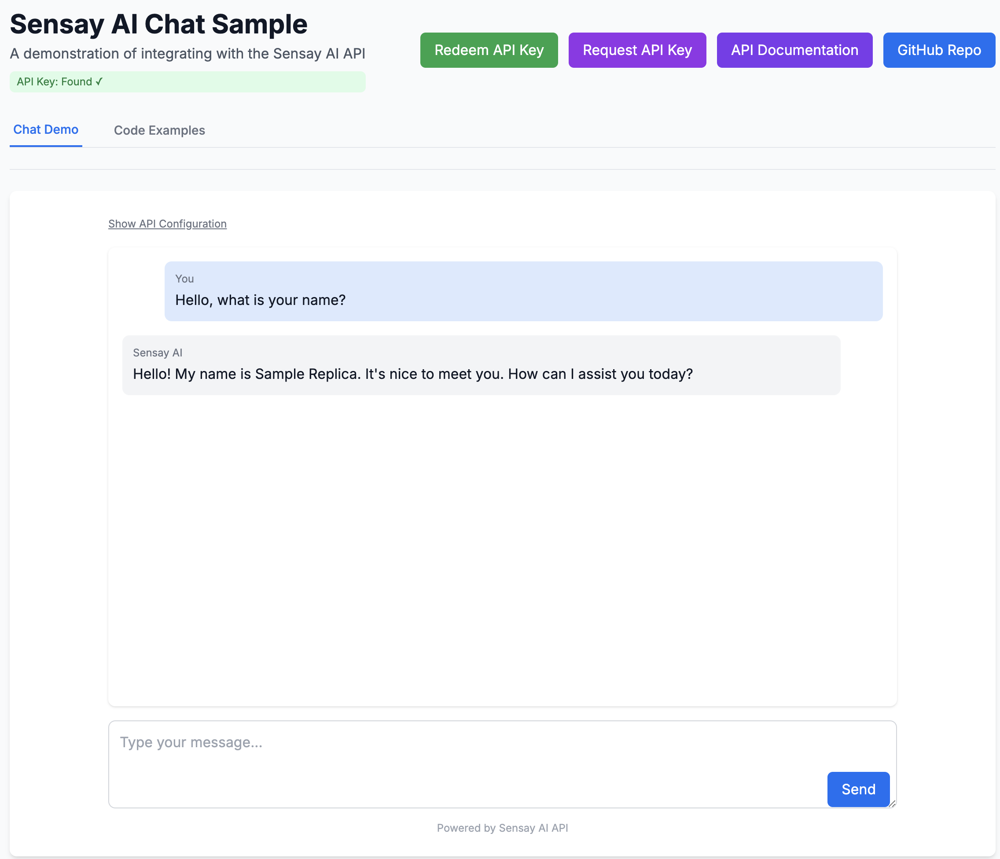

# Sensay AI Chat Client Sample

A sample Next.js application demonstrating how to integrate with the Sensay AI API. This project showcases a simple chat interface for communicating with Sensay Wisdom AI through their REST OpenAPI.



## ✨ Features

- Modern React application built with Next.js and TypeScript
- Responsive chat interface with automatic user and replica management
- Clean, responsive UI using Tailwind CSS
- Typed API client for the Sensay AI API
- Code examples for quick integration
- Environment variable support for API keys

## 🛠️ Tech Stack

- **Framework**: Next.js with TypeScript
- **Styling**: Tailwind CSS
- **API SDK**: openapi-typescript-codegen
- **HTTP Client**: Fetch API
- **Code Highlighting**: react-syntax-highlighter

## 📋 Prerequisites

- Node.js 18+ and npm/yarn
- A Sensay AI API key

### Node.js Version Management

This project works best with Node.js v18+ or v20+. We recommend using [fnm](https://github.com/Schniz/fnm) (Fast Node Manager) to manage your Node.js versions:

#### Installing fnm

```bash
# Using Homebrew on macOS
brew install fnm

# Using curl on macOS or Linux
curl -fsSL https://fnm.vercel.app/install | bash
```

#### Using fnm with this project

```bash
# Install Node.js v20 (LTS)
fnm install 20

# Use Node.js v20 for this project
cd /path/to/sensay-chat-client-sample
fnm use 20

# Alternatively, you can use the exact version specified in .node-version
fnm use
```

⚠️ **Important**: This project requires Node.js >= 18.17.0. If you're seeing errors about Node.js version compatibility, make sure to run:

```bash
# Check your current Node.js version
node -v

# If you see a version lower than 18.17.0, switch to a compatible version
fnm use 20
# or
fnm use 18.17.0
```

You can also create a `.node-version` or `.nvmrc` file in the project root to automatically set the Node.js version when entering the directory (requires additional shell setup).

## ❓ Troubleshooting

### Node.js Version Errors

If you encounter the following error when running `npm run dev`:

```
You are using Node.js 18.12.0. For Next.js, Node.js version >= v18.17.0 is required.
```

This means you need to upgrade your Node.js version. Run the following commands:

```bash
# Install a compatible version if needed
fnm install 20

# Switch to the compatible version
fnm use 20

# Verify the version is now correct
node -v
```

Then try running the development server again:

```bash
npm run dev
```

## 🚀 Getting Started

### Installation

1. Clone the repository:

```bash
git clone https://github.com/sensay-io/chat-client-sample.git
cd chat-client-sample
```

2. Install dependencies:

```bash
npm install
# or
yarn install
```

3. Create a `.env.local` file in the root directory and add your API key:

```
NEXT_PUBLIC_SENSAY_API_KEY_SECRET=your_api_key_here
```

4. Start the development server:

```bash
npm run dev
# or
yarn dev
```

5. Open [http://localhost:3000](http://localhost:3000) in your browser.

## 📚 API Client Usage

### Initialization

```typescript
import { SensayAPI } from '@/sensay-sdk';
import { SAMPLE_USER_ID, SAMPLE_REPLICA_SLUG, API_VERSION } from '@/constants/auth';

// Initialize organization-only client (no user authentication)
const orgClient = new SensayAPI({
  HEADERS: {
    'X-ORGANIZATION-SECRET': process.env.NEXT_PUBLIC_SENSAY_API_KEY_SECRET
  }
});

// Use user-authenticated client for operations
const client = new SensayAPI({
  HEADERS: {
    'X-ORGANIZATION-SECRET': process.env.NEXT_PUBLIC_SENSAY_API_KEY_SECRET,
    'X-USER-ID': SAMPLE_USER_ID
  }
});
```

### User and Replica Management

```typescript
// Check if user exists
let userExists = false;
try {
  await orgClient.users.getV1Users(SAMPLE_USER_ID);
  userExists = true;
} catch (error) {
  console.log('User does not exist, will create');
}

// Create user if needed
if (!userExists) {
  await orgClient.users.postV1Users(API_VERSION, {
    id: SAMPLE_USER_ID,
    email: `${SAMPLE_USER_ID}@example.com`,
    name: "Sample User"
  });
}

// List replicas to find our sample replica
const replicas = await client.replicas.getV1Replicas();
let replicaId;

// Look for the sample replica by slug
if (replicas.items && replicas.items.length > 0) {
  const sampleReplica = replicas.items.find(replica => 
    replica.slug === SAMPLE_REPLICA_SLUG
  );
  if (sampleReplica) {
    replicaId = sampleReplica.uuid;
  }
}

// Create the sample replica if it doesn't exist
if (!replicaId) {
  const newReplica = await client.replicas.postV1Replicas(API_VERSION, {
    name: "Sample Replica",
    shortDescription: "A sample replica for demonstration",
    greeting: "Hello, I'm the sample replica. How can I help you today?",
    slug: SAMPLE_REPLICA_SLUG,
    ownerID: SAMPLE_USER_ID,
    llm: {
      model: "claude-3-7-sonnet-latest",
      memoryMode: "prompt-caching",
      systemMessage: "You are a helpful AI assistant that provides clear and concise responses."
    }
  });
  replicaId = newReplica.uuid;
}
```

### Creating a Chat Completion

```typescript
// Standard chat completion
const response = await client.chatCompletions.postV1ReplicasChatCompletions(
  replicaId,
  API_VERSION,
  {
    content: 'Hello, how can you help me today?',
    source: 'web',
    skip_chat_history: false
  }
);

console.log(response.content);
```

### OpenAI-Compatible Endpoint (experimental)

```typescript
// Using the OpenAI-compatible experimental endpoint
const response = await client.chatCompletions.postV1ExperimentalReplicasChatCompletions(
  replicaId,
  {
    messages: [
      { role: 'system', content: 'You are a helpful assistant.' },
      { role: 'user', content: 'Hello, how can you help me today?' }
    ],
    source: 'web',
    store: true
  }
);

console.log(response.choices[0].message.content);
```

## 📝 Environment Variables

| Variable                           | Description                               | Required |
|------------------------------------|-------------------------------------------|----------|
| `NEXT_PUBLIC_SENSAY_API_KEY_SECRET`| Your Sensay API key                       | No       |

Note: No replica UUID is needed - the application will automatically create or reuse a replica at runtime.
## 🔧 Project Structure

```
/
├── public/             # Static assets
├── src/                # Source code
│   ├── app/            # Next.js App Router
│   │   ├── page.tsx    # Home page with demo
│   │   └── layout.tsx  # Root layout
│   ├── components/     # React components
│   │   ├── ChatInterface.tsx  # Chat UI component
│   │   ├── CodeBlock.tsx      # Code display component
│   │   ├── RedeemKeyModal.tsx # API key redemption modal
│   │   └── EnvChecker.tsx     # Environment variable checker
│   ├── constants/      # Application constants
│   │   └── auth.ts     # Authentication constants
│   ├── sensay-sdk/     # Generated Sensay API SDK
│   │   ├── index.ts    # SDK entry point
│   │   ├── models/     # SDK model types
│   │   ├── services/   # SDK service implementations
│   │   └── core/       # SDK core utilities
│   └── styles/         # Global styles
│       └── globals.css # Tailwind CSS imports
├── .env.local          # Environment variables (create this)
├── .env.local.example  # Example environment file
├── tsconfig.json       # TypeScript configuration
├── next.config.js      # Next.js configuration
├── tailwind.config.js  # Tailwind CSS configuration
└── package.json        # Project dependencies and scripts
```

## 🤝 Contributing

1. Fork the repository
2. Create your feature branch (`git checkout -b feature/amazing-feature`)
3. Commit your changes (`git commit -m 'Add some amazing feature'`)
4. Push to the branch (`git push origin feature/amazing-feature`)
5. Open a Pull Request

## 📜 License

Distributed under the MIT License. See `LICENSE` for more information.

## 🔗 Links

- [Sensay AI Website](https://sensay.io)
- [Sensay AI API Documentation](https://docs.sensay.io)
- [Next.js Documentation](https://nextjs.org/docs)
- [Tailwind CSS Documentation](https://tailwindcss.com/docs)

## 🔄 Updating the SDK

This project uses the [openapi-typescript-codegen](https://github.com/ferdikoomen/openapi-typescript-codegen) library to generate TypeScript clients from the Sensay OpenAPI schema. The generated SDK is stored in the `src/sensay-sdk` directory.

To update the SDK when the API changes, run the provided npm script:

```bash
npm run generate-sdk
```

This will:
1. Fetch the latest OpenAPI schema from `https://api.sensay.io/schema`
2. Generate fully typed TypeScript client code in the `src/sensay-sdk` directory
3. Create service classes for each API endpoint group
4. Provide type definitions for all request and response objects